<!-- ================= ANIMATED HEADER ================= -->

  

  

<!-- ================= HERO CARD (upload ai-analyst.svg in the same repo) ================= -->

  

  
  
  

---

## 🧠 Tech Stack

    
  
  
  
  
  
  

## 🤖 AI & Vibe Coding Toolkit

  
  
  
  
  

---

## 🔬 Featured Projects

| Project | What it is | Links |
|---|---|---|
| 🤖 **Dataplus.DeckAi** | AI deck generator built with Lovable: upload a file, get a deck, optimise an existing deck, chat to refine | [🔗 Live App](YOUR_LOVABLE_APP_LINK) |
| 🚖 **Uber Performance Dashboard** | Power BI dashboard for ride & customer analysis | [GitHub](https://github.com/mueez-mapari2005/Uber-Performance-Dashboard-for-Ride-and-Customer-Analysis) · [Preview](https://github.com/mueez-mapari2005/Uber-Performance-Dashboard-for-Ride-and-Customer-Analysis/blob/main/View%20dashboard%20Image%20.pdf) |
| 🛒 **Zepto Excel Dashboard** | Interactive Excel dashboard | [GitHub](https://github.com/mueez-mapari2005/Mini-Project/blob/main/Screenshot%202025-08-01%20111533.png) · [Colab](https://colab.research.google.com/drive/1MCKm3UyMGbOUy0N2ZyL4l2uy-4ZT4wFR?usp=sharing) |
| 👗 **Ajio Data Analysis** | EDA using Python | [GitHub](https://github.com/mueez-mapari2005/Mini-Project/blob/main/ajio_EDA.ipynb) · [Colab](https://colab.research.google.com/drive/1uMd5tRJhn-o4Cv-6CGVxGKqkplXbZMwg?usp=sharing) |
| ✨ **Generative AI for Data Analysts** | Using GenAI inside analyst workflows | [Colab](https://colab.research.google.com/drive/1dj8mzCXoi5bQd7rEMg78CqHUAv_-l1U-?usp=sharing) |

---

## 📊 GitHub Stats

  
  

  

## 📫 Let's Connect

  
  

  

